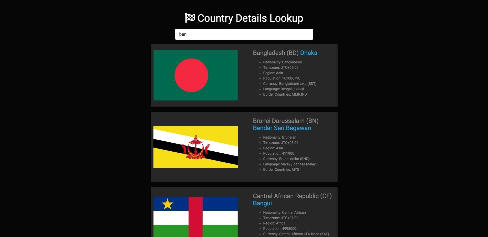

# JavaScript Country Details Lookup :checkered_flag:
---
## :ghost: Screenshot

## :rocket::rocket::rocket: <a href="https://www.js.faisalahammad.ml/country_details/">Live Demo</a> :rocket::rocket::rocket:
## :gift_heart: Credits:
<ul>
	<li>Tutorial: <a href="https://www.youtube.com/watch?v=1iysNUrI3lw" target="_blank">Traversy Media</a></li>
	<li>API: <a href="https://restcountries.eu/rest/v2/all" target="_blank">Restcountries.eu</a></li>
</ul>